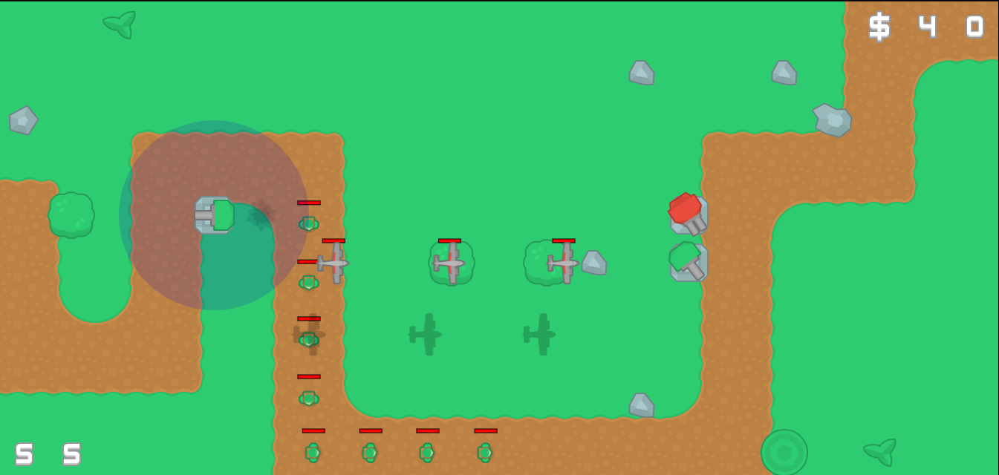

# Tower Defense [W.I.P]

A (unfinished) tower defense game written in vanilla JavaScript.



[Live version](https://victorribeiro.com/towerDefense/)

Safari (iOs) users may need to disable [Prevent cross-site tracking](https://support.apple.com/guide/safari/prevent-cross-site-tracking-sfri40732/mac) to view canvas applications, such as this game.

## Controls

Mouse / Left click - Select objects and place towers.

Keyboard keys:  
**1** - Single Cannon Tower

**2** - Double Cannon Tower

**3** - Double Missile Launcher

**4** - Single Missile Launcher

**D** - Deletes a selected item

**Enter** - Calls the wave of enemies

**Space** - Pause game

*To either buy or delete items you need to have money*


## ToDo

* Finish the game
  * Right now this is more a prototype than a game, since it doesn't end.
  * Implement victory
  * Implement defeat
* Refactor code
  * Remove some redundancies (Almost every class has a distance function)
  * Create utils.js and move helper functions to it (including a general distance function)
  * Check for hardcoded values
* Create GUI
  * Mobile
  * Desktop
* Improve enemies
  * Airplanes behavior
  * Tanks aggressiveness
* Balance game
  * Price of towers
  * Amount of money you get by killing a enemie
  * How much damage each tower does
  * How much damage each tank does
* Create world map
  * A world map consists in a pack of levels of increasingly difficulty
* Level generation
  * Improve level generation
  * Export function so it can be called from the browser to generate new levels
* Sound Manager
  * Merge sound and music manager
  * Add playlist to the transiction feature (smoothly going from a song to another)
* Fix worker and manifest.json to it can be installed as a PWA

## For Programmers

If you open the console and call:

**reload()** - It start cycling to all possible texture combinations

**transposeMap()** - It transposes the map. Intended to adapt the map for both horizontal and vertical screens

Navigate to *levelGenerator* folder and call:

```bash
node levelGen.js
```

to generate a new map (saves a *map.json* file in the parent folder)

## Credits

Textures by Kenney - [www.kenney.nl](www.kenney.nl)

Sounds from everywhere - I'll keep better track of where I got the sound and music next time, sorry
